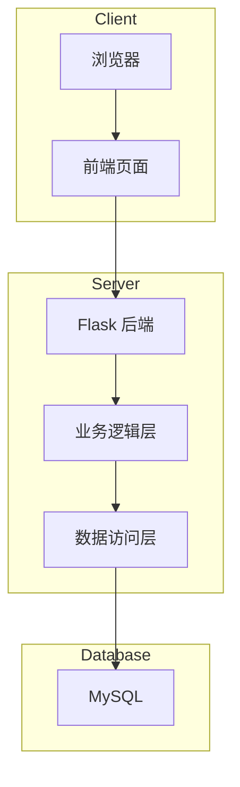

# 智慧党建系统技术设计文档

## 1. 系统概述

智慧党建系统是一个基于Web的信息管理平台，采用前后端分离架构。后端使用Python Flask框架，前端使用原生HTML/JavaScript，数据库使用MySQL。

## 2. 技术架构



## 3. 技术选型

| 层级 | 技术方案 | 说明 |
|------|----------|------|
| 后端框架 | Flask | 轻量级Python Web框架 |
| 数据库 | MySQL | 关系型数据库 |
| 数据库驱动 | PyMySQL | 纯Python实现，兼容性好 |
| 前端 | HTML5 + 原生JavaScript | 无需构建工具，开箱即用 |
| 图片存储 | 本地文件系统 | 简化部署，降低复杂度 |
| 密码加密 | bcrypt | 安全可靠的单向加密 |

## 4. 数据库设计

### 4.1 数据表结构

#### 4.1.1 用户表 (users)

| 字段名 | 类型 | 说明 |
|--------|------|------|
| id | INT PRIMARY KEY AUTO_INCREMENT | 用户ID |
| username | VARCHAR(50) UNIQUE NOT NULL | 用户名 |
| password_hash | VARCHAR(255) NOT NULL | 加密后的密码 |
| role | ENUM('admin', 'user') NOT NULL DEFAULT 'user' | 角色 |
| avatar | VARCHAR(500) | 头像URL路径 |
| bio | TEXT | 个人简介 |
| email | VARCHAR(100) | 邮箱 |
| phone | VARCHAR(20) | 手机号 |
| created_at | DATETIME NOT NULL DEFAULT CURRENT_TIMESTAMP | 创建时间 |
| last_login_at | DATETIME | 最后登录时间 |

#### 4.1.2 内容表 (contents)

| 字段名 | 类型 | 说明 |
|--------|------|------|
| id | INT PRIMARY KEY AUTO_INCREMENT | 内容ID |
| title | VARCHAR(255) NOT NULL | 标题 |
| body | TEXT NOT NULL | 正文内容 |
| images | JSON | 图片路径数组 |
| author_id | INT NOT NULL | 作者ID |
| created_at | DATETIME NOT NULL DEFAULT CURRENT_TIMESTAMP | 创建时间 |

#### 4.1.3 评论表 (comments)

| 字段名 | 类型 | 说明 |
|--------|------|------|
| id | INT PRIMARY KEY AUTO_INCREMENT | 评论ID |
| content_id | INT NOT NULL | 关联内容ID |
| user_id | INT NOT NULL | 评论者ID |
| body | TEXT NOT NULL | 评论内容 |
| created_at | DATETIME NOT NULL DEFAULT CURRENT_TIMESTAMP | 评论时间 |

#### 4.1.4 点赞表 (likes)

| 字段名 | 类型 | 说明 |
|--------|------|------|
| id | INT PRIMARY KEY AUTO_INCREMENT | 点赞ID |
| content_id | INT NOT NULL | 关联内容ID |
| user_id | INT NOT NULL | 点赞者ID |
| created_at | DATE NOT NULL | 点赞日期 |

#### 4.1.5 访问统计表 (visits)

| 字段名 | 类型 | 说明 |
|--------|------|------|
| id | INT PRIMARY KEY AUTO_INCREMENT | 记录ID |
| visit_date | DATE NOT NULL | 访问日期 |
| visit_count | INT NOT NULL DEFAULT 0 | 访问次数 |

#### 4.1.6 操作审计日志表 (operation_logs)

| 字段名 | 类型 | 说明 |
|--------|------|------|
| id | INT PRIMARY KEY AUTO_INCREMENT | 日志ID |
| user_id | INT NULL | 用户ID |
| username | VARCHAR(50) NOT NULL | 用户名 |
| operation | VARCHAR(100) NOT NULL | 操作类型 |
| detail | TEXT | 操作详情（JSON格式） |
| ip_address | VARCHAR(45) | 客户端IP地址 |
| user_agent | VARCHAR(255) | 浏览器User-Agent |
| created_at | DATETIME NOT NULL DEFAULT CURRENT_TIMESTAMP | 创建时间 |

**索引**: `idx_user_time (user_id, created_at)`, `idx_operation_time (operation, created_at)`, `idx_username_time (username, created_at)`

## 5. API接口设计

### 5.1 认证接口

| 方法 | 路径 | 说明 | 认证 |
|------|------|------|------|
| POST | /api/auth/login | 用户登录 | 否 |
| POST | /api/auth/logout | 用户登出 | 是 |
| POST | /api/auth/register | 用户注册 | 否 |
| GET | /api/auth/me | 获取当前用户信息 | 是 |

### 5.2 用户管理接口

| 方法 | 路径 | 说明 | 认证 | 权限 |
|------|------|------|------|------|
| GET | /api/users | 获取用户列表 | 是 | 管理员 |
| POST | /api/users | 创建用户 | 是 | 管理员 |
| DELETE | /api/users/:id | 删除用户 | 是 | 管理员 |
| GET | /api/profile | 获取当前用户资料（含头像） | 是 | - |
| PUT | /api/profile | 更新用户资料 | 是 | - |
| POST | /api/profile/avatar | 上传头像 | 是 | - |
| PUT | /api/profile/password | 修改密码 | 是 | - |

### 5.2.1 文件访问接口

| 方法 | 路径 | 说明 | 认证 |
|------|------|------|------|
| GET | /uploads/\<path:filename\> | 访问上传的文件 | 否 |

### 5.3 内容接口

| 方法 | 路径 | 说明 | 认证 |
|------|------|------|------|
| GET | /api/contents | 获取内容列表 | 否 |
| GET | /api/contents/:id | 获取内容详情 | 否 |
| POST | /api/contents | 创建内容 | 是 |
| DELETE | /api/contents/:id | 删除内容 | 是 |

### 5.4 评论接口

| 方法 | 路径 | 说明 | 认证 |
|------|------|------|------|
| GET | /api/contents/:id/comments | 获取内容的评论 | 否 |
| POST | /api/contents/:id/comments | 添加评论 | 是 |
| DELETE | /api/comments/:id | 删除评论 | 是 |

### 5.5 点赞接口

| 方法 | 路径 | 说明 | 认证 |
|------|------|------|------|
| POST | /api/contents/:id/like | 点赞内容 | 是 |
| DELETE | /api/contents/:id/like | 取消点赞 | 是 |

### 5.6 统计接口

| 方法 | 路径 | 说明 | 认证 |
|------|------|------|------|
| GET | /api/stats/visits | 获取访问统计 | 否 |

### 5.7 审计日志接口

| 方法 | 路径 | 说明 | 认证 | 权限 |
|------|------|------|------|------|
| GET | /api/audit/logs | 获取审计日志列表（支持翻页） | 是 | 管理员 |
| GET | /api/audit/operations | 获取支持的操作类型列表 | 是 | 管理员 |
| GET | /api/audit/logs/export | 导出审计日志（CSV格式） | 是 | 管理员 |

**GET /api/audit/logs 参数**:

| 参数 | 类型 | 说明 |
|------|------|------|
| page | int | 页码（默认1） |
| per_page | int | 每页条数（默认50，最大200） |
| operation | string | 操作类型过滤 |
| user_id | int | 用户ID过滤 |
| username | string | 用户名过滤 |
| start_date | string | 开始日期（YYYY-MM-DD） |
| end_date | string | 结束日期（YYYY-MM-DD） |

**GET /api/audit/logs/export 参数**:

| 参数 | 类型 | 说明 |
|------|------|------|
| operation | string | 操作类型过滤 |
| user_id | int | 用户ID过滤 |
| username | string | 用户名过滤 |
| start_date | string | 开始日期（YYYY-MM-DD） |
| end_date | string | 结束日期（YYYY-MM-DD） |

## 6. 核心模块设计

### 6.1 认证模块

```
认证模块负责用户登录、会话管理、权限验证

主要功能:
1. 用户登录验证 (verify_credentials)
2. 创建会话令牌 (create_session)
3. 验证会话有效性 (verify_session)
4. 密码加密 (hash_password)
```

### 6.2 内容管理模块

```
内容管理模块负责党建内容的CRUD操作

主要功能:
1. 创建内容 (create_content)
2. 获取内容列表 (get_contents)
3. 获取内容详情 (get_content)
4. 删除内容 (delete_content)
```

### 6.3 互动模块

```
互动模块负责评论和点赞功能

主要功能:
1. 添加评论 (add_comment)
2. 删除评论 (delete_comment)
3. 点赞内容 (like_content)
4. 检查今日是否已点赞 (check_today_like)
```

### 6.4 统计模块

```
统计模块负责访问次数和点赞统计

主要功能:
1. 记录访问 (record_visit)
2. 获取访问统计 (get_visit_stats)
3. 统计内容点赞数 (get_content_likes)
```

### 6.5 审计日志模块

```
审计日志模块负责记录和查询用户操作日志

主要功能:
1. 记录操作日志 (log_operation)
2. 获取操作日志列表 (get_operation_logs)
3. 获取日志总数 (get_log_count)
4. 获取所有日志用于导出 (get_operation_logs_for_export)

日志操作类型:
- login_success: 登录成功
- login_failed: 登录失败
- logout: 登出
- create_content: 发布内容
- create_comment: 发布评论
- update_profile: 更新资料
- upload_avatar: 上传头像
- change_password: 修改密码
- delete_content: 删除内容
- delete_comment: 删除评论
```

## 7. 安全设计

### 7.1 密码安全
- 使用bcrypt进行密码哈希存储
- 登录时验证哈希值

### 7.2 SQL注入防护
- 使用参数化查询 (Parameterized Queries)
- 禁止字符串拼接构建SQL语句

### 7.3 XSS防护
- 对用户输入进行HTML转义
- 使用Jinja2模板的自动转义功能

### 7.4 越权防护
- 删除/修改操作前验证资源所有权
- Session中存储用户ID，验证操作权限

### 7.5 Session安全
- Session存储在服务器端
- 设置Session过期时间
- 使用安全的Cookie配置

### 7.6 文件上传安全
- 仅允许白名单中的图片格式（PNG、JPG、JPEG、GIF、WEBP）
- 通过文件扩展名、MIME类型和魔术数字（Magic Number）三重验证
- 文件大小限制：最大 2MB
- 图片尺寸限制：最大 1024x1024 像素
- 使用随机文件名防止冲突和路径猜测
- 上传目录与应用代码隔离
- 通过 `/uploads/<path:filename>` 路由提供文件访问服务

## 8. 前端页面结构

```
templates/
├── base.html          # 基础模板
├── index.html         # 首页（党建之声列表）
├── login.html         # 登录页面
├── register.html      # 注册页面
├── content.html       # 内容详情页
├── create.html        # 创建内容页
└── manage.html        # 用户管理页（管理员）
```

## 9. 项目结构

```
party-building-system/
├── app.py                 # Flask应用主入口
├── config.py              # 配置文件
├── database.py            # 数据库连接模块
├── models.py              # 数据模型
├── utils/                 # 工具函数
│   ├── auth.py            # 认证工具
│   ├── security.py        # 安全工具
│   ├── stats.py           # 统计工具
│   └── operation_log.py   # 操作审计日志工具
├── routes/                # 路由模块
│   ├── auth.py            # 认证路由
│   ├── users.py           # 用户管理路由
│   ├── contents.py        # 内容路由
│   ├── profile.py         # 用户资料路由（含头像上传）
│   ├── stats.py           # 统计路由
│   └── audit.py           # 审计日志路由
├── static/                # 静态文件
│   ├── css/
│   │   └── style.css      # 样式文件
│   └── js/
│       └── main.js        # JavaScript
├── templates/             # HTML模板
│   ├── base.html          # 基础模板
│   ├── index.html         # 首页（党建之声列表）
│   ├── login.html         # 登录页面
│   ├── register.html      # 注册页面
│   ├── content.html       # 内容详情页
│   ├── create.html        # 创建内容页
│   ├── manage.html        # 用户管理页（管理员）
│   └── audit.html         # 审计日志页（管理员）
├── uploads/               # 上传的图片
├── db/                    # 数据库脚本
│   ├── init.sql          # 初始化脚本
│   └── migration_audit.sql # 审计日志表迁移脚本
└── deploy/                # 部署文档
    └── README.md          # 部署说明
```

## 10. 部署方案

### 10.1 环境要求
- Python 3.8+
- MySQL 5.7+

### 10.2 部署步骤
1. 创建MySQL数据库并执行初始化脚本
2. 安装Python依赖
3. 配置数据库连接
4. 启动Flask应用

详细部署说明见 `deploy/README.md`

## 11. 错误处理

| 错误码 | 说明 |
|--------|------|
| 200 | 成功 |
| 400 | 请求参数错误 |
| 401 | 未登录或认证失败 |
| 403 | 权限不足 |
| 404 | 资源不存在 |
| 500 | 服务器内部错误 |

## 12. 测试策略

### 12.1 功能测试
- 用户注册登录流程
- 内容创建、查看、删除
- 评论添加、删除
- 点赞、取消点赞
- 访问统计
- 审计日志查看、筛选、翻页
- 审计日志下载（CSV格式）

### 12.2 安全测试
- SQL注入测试
- XSS攻击测试
- 越权操作测试
- 非管理员无法访问审计日志

## 13. 参考资料

- Flask Documentation: https://flask.palletsprojects.com/
- PyMySQL: https://pymysql.readthedocs.io/
- bcrypt: https://pypi.org/project/bcrypt/
