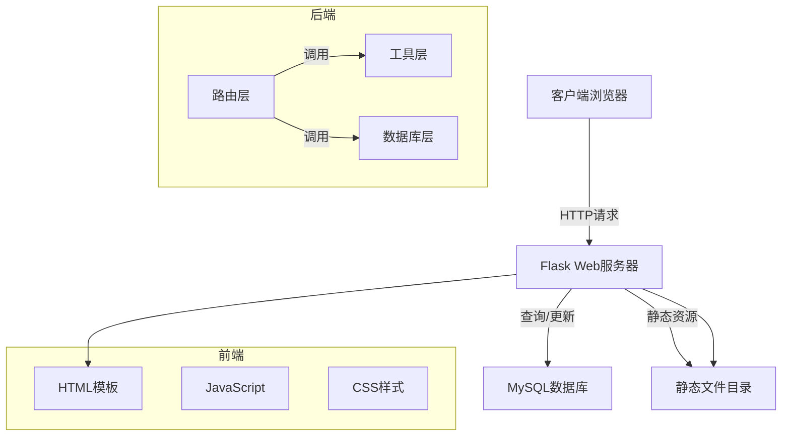

# 智慧党建系统技术方案文档

## 1. 系统架构

### 1.1 整体架构

本系统采用经典的MVC架构，使用Flask作为Web框架，MySQL作为数据库，前端使用原生HTML/CSS/JavaScript。



### 1.2 技术栈

| 层级 | 技术 | 版本要求 |
|------|------|----------|
| 后端框架 | Flask | 2.x |
| 数据库 | MySQL | 5.7+ |
| 数据库驱动 | PyMySQL | 1.x |
| 密码加密 | bcrypt | 4.x |
| 前端框架 | 原生HTML/CSS/JS | - |
| Web服务器 | Flask内置开发服务器 | - |

### 1.3 项目结构

```
party-building/
├── app.py                    # Flask应用主入口
├── config.py                 # 配置文件
├── database.py               # 数据库连接模块
├── change_password.py        # 密码修改工具
├── requirements.txt          # Python依赖
├── logs/                     # 日志目录
├── webapp/
│   ├── routes/               # 路由模块
│   │   ├── auth.py           # 认证路由
│   │   ├── users.py          # 用户管理路由
│   │   ├── contents.py       # 内容管理路由
│   │   ├── stats.py          # 统计路由
│   │   ├── notices.py        # 公告路由
│   │   ├── profile.py        # 用户资料路由
│   │   ├── audit.py          # 审计日志路由
│   │   └── categories.py     # 分类路由
│   ├── utils/                # 工具模块
│   │   ├── auth.py           # 认证工具
│   │   ├── security.py        # 安全工具
│   │   ├── stats.py          # 统计工具
│   │   └── operation_log.py  # 操作日志工具
│   ├── templates/            # HTML模板
│   │   ├── base.html         # 基础模板
│   │   ├── index.html        # 首页
│   │   ├── login.html        # 登录页
│   │   ├── register.html     # 注册页
│   │   ├── create.html       # 发布内容页
│   │   ├── content.html      # 内容详情页
│   │   ├── profile.html      # 个人资料页
│   │   ├── manage.html       # 用户管理页
│   │   ├── notices.html      # 公告管理页
│   │   ├── audit.html        # 审计日志页
│   │   └── error.html        # 错误页
│   ├── static/               # 静态资源
│   │   ├── css/
│   │   │   └── style.css     # 样式文件
│   │   └── js/
│   │       └── main.js       # JavaScript文件
│   └── uploads/              # 上传文件目录
└── docs/                     # 项目文档
    ├── requirements.md      # 需求文档
    ├── design.md             # 本文档
    ├── deployment.md         # 部署文档
    └── migration_*.sql       # 数据库迁移脚本
```

---

## 2. 数据库设计

### 2.1 数据表

#### 2.1.1 users 表（用户表）

| 字段 | 类型 | 约束 | 说明 |
|------|------|------|------|
| id | INT | 主键、自增 | 用户ID |
| username | VARCHAR(50) | 唯一、非空 | 用户名 |
| password_hash | VARCHAR(255) | 非空 | 加密后的密码 |
| role | ENUM('user','admin') | 默认'user' | 用户角色 |
| created_at | DATETIME | 默认当前时间 | 创建时间 |

#### 2.1.2 contents 表（内容表）

| 字段 | 类型 | 约束 | 说明 |
|------|------|------|------|
| id | INT | 主键、自增 | 内容ID |
| title | VARCHAR(255) | 非空 | 标题 |
| body | TEXT | 非空 | 正文内容 |
| images | JSON | 可为空 | 附件路径数组 |
| author_id | INT | 外键->users.id | 作者ID |
| created_at | DATETIME | 默认当前时间 | 创建时间 |

#### 2.1.3 comments 表（评论表）

| 字段 | 类型 | 约束 | 说明 |
|------|------|------|------|
| id | INT | 主键、自增 | 评论ID |
| content_id | INT | 外键->contents.id | 内容ID |
| user_id | INT | 外键->users.id | 评论者ID |
| body | TEXT | 非空 | 评论内容 |
| created_at | DATETIME | 默认当前时间 | 创建时间 |

#### 2.1.4 likes 表（内容点赞表）

| 字段 | 类型 | 约束 | 说明 |
|------|------|------|------|
| id | INT | 主键、自增 | 点赞ID |
| content_id | INT | 外键->contents.id | 内容ID |
| user_id | INT | 外键->users.id | 点赞用户ID |
| created_at | DATE | 非空 | 点赞日期 |

#### 2.1.5 comment_likes 表（评论点赞表）

| 字段 | 类型 | 约束 | 说明 |
|------|------|------|------|
| id | INT | 主键、自增 | 点赞ID |
| comment_id | INT | 外键->comments.id | 评论ID |
| user_id | INT | 外键->users.id | 点赞用户ID |
| created_at | DATE | 非空 | 点赞日期 |

#### 2.1.6 visits 表（访问统计表）

| 字段 | 类型 | 约束 | 说明 |
|------|------|------|------|
| id | INT | 主键、自增 | ID |
| visit_date | DATE | 唯一、非空 | 访问日期 |
| visit_count | INT | 默认0 | 访问次数 |

#### 2.1.7 notices 表（公告表）

| 字段 | 类型 | 约束 | 说明 |
|------|------|------|------|
| id | INT | 主键、自增 | 公告ID |
| title | VARCHAR(200) | 非空 | 公告标题 |
| content | TEXT | 非空 | 公告内容 |
| author_id | INT | 外键->users.id | 发布者ID |
| created_at | DATETIME | 默认当前时间 | 发布时间 |

---

## 3. 模块设计

### 3.1 路由层

#### 3.1.1 认证模块 (auth.py)

| 接口 | 方法 | 说明 |
|------|------|------|
| /api/auth/login | POST | 用户登录（需验证码） |
| /api/auth/logout | POST | 用户登出 |
| /api/auth/register | POST | 用户注册 |
| /api/auth/me | GET | 获取当前用户信息 |
| /api/auth/check | GET | 检查登录状态 |
| /api/auth/captcha | GET | 获取算术验证码 |

#### 3.1.2 用户模块 (users.py)

| 接口 | 方法 | 说明 |
|------|------|------|
| /api/users | GET | 获取用户列表（管理员） |
| /api/users | POST | 创建用户（管理员） |
| /api/users/:id | DELETE | 删除用户（管理员） |
| /api/users/:id/profile | GET | 获取指定用户的公开资料 |

#### 3.1.3 内容模块 (contents.py)

| 接口 | 方法 | 说明 |
|------|------|------|
| /api/contents | GET | 获取内容列表 |
| /api/contents | POST | 创建内容 |
| /api/contents/:id | GET | 获取内容详情 |
| /api/contents/:id | DELETE | 删除内容 |
| /api/contents/:id/comments | GET | 获取评论列表 |
| /api/contents/:id/comments | POST | 添加评论 |
| /api/comments/:id | DELETE | 删除评论 |
| /api/contents/:id/like | POST | 点赞内容 |
| /api/contents/:id/like | DELETE | 取消点赞 |
| /api/comments/:id/like | POST | 点赞评论 |
| /api/comments/:id/like | DELETE | 取消点赞 |

#### 3.1.4 统计模块 (stats.py)

| 接口 | 方法 | 说明 |
|------|------|------|
| /api/stats/visits | GET | 获取访问统计 |

#### 3.1.5 公告模块 (notices.py)

| 接口 | 方法 | 说明 |
|------|------|------|
| /api/notices | GET | 获取公告列表 |
| /api/notices | POST | 发布公告（管理员） |
| /api/notices/:id | DELETE | 删除公告（管理员） |

#### 3.1.6 审计模块 (audit.py)

| 接口 | 方法 | 说明 |
|------|------|------|
| /api/audit/logs | GET | 获取审计日志列表（管理员） |
| /api/audit/operations | GET | 获取操作类型列表（管理员） |

**GET /api/audit/logs 查询参数：**

| 参数 | 类型 | 说明 |
|------|------|------|
| page | int | 页码（默认1） |
| per_page | int | 每页数量（默认50，最大200） |
| operation | string | 操作类型过滤（精确匹配） |
| username | string | 用户名过滤（模糊匹配） |
| user_id | int | 用户ID过滤（精确匹配） |
| start_date | string | 开始日期（格式：YYYY-MM-DD） |
| end_date | string | 结束日期（格式：YYYY-MM-DD） |

**响应格式：**

```json
{
    "code": 200,
    "data": {
        "logs": [...],
        "pagination": {
            "total": 100,
            "page": 1,
            "per_page": 50,
            "pages": 2
        }
    }
}
```

### 3.2 工具层

#### 3.2.1 认证工具 (utils/auth.py)

| 函数 | 说明 |
|------|------|
| hash_password() | bcrypt密码加密 |
| verify_password() | 密码验证 |
| create_user() | 创建用户 |
| get_user_by_username() | 根据用户名查询用户 |
| get_user_by_id() | 根据ID查询用户 |
| get_all_users() | 获取所有用户 |
| delete_user() | 删除用户 |
| update_user_password() | 更新密码 |

#### 3.2.2 安全工具 (utils/security.py)

| 函数 | 说明 |
|------|------|
| escape_html() | HTML转义，防止XSS |
| sanitize_filename() | 文件名安全化 |
| validate_username() | 用户名格式验证 |
| validate_password() | 密码强度验证 |
| validate_title() | 标题验证 |
| validate_content() | 内容验证 |

#### 3.2.3 统计工具 (utils/stats.py)

| 函数 | 说明 |
|------|------|
| record_visit() | 记录访问 |
| get_visit_stats() | 获取访问统计 |
| get_content_like_count() | 获取内容点赞数 |
| check_user_liked_today() | 检查用户今日是否点赞 |
| add_like() | 添加点赞 |
| remove_like() | 移除点赞 |
| get_comment_like_count() | 获取评论点赞数 |
| check_user_comment_liked_today() | 检查用户今日是否点赞评论 |
| add_comment_like() | 添加评论点赞 |
| remove_comment_like() | 移除评论点赞 |

### 3.3 前端模块

#### 3.3.1 JavaScript模块 (main.js)

| 对象 | 说明 |
|------|------|
| utils | 工具函数：提示消息、日期格式化、API请求 |
| auth | 认证功能：登录、注册、登出、状态检查 |
| contents | 内容功能：列表、详情、发布、删除、评论、点赞 |
| stats | 统计功能：获取和显示访问统计 |
| userManage | 用户管理：列表、创建、删除 |
| userCard | 用户资料卡：弹窗显示用户公开资料 |

---

## 4. 安全设计

### 4.1 认证与授权

- 密码使用bcrypt加密存储
- Session配置HttpOnly防止XSS窃取
- Session配置SameSite=Lax防止CSRF
- Session有效期24小时
- 登录需通过算术验证码，防止暴力破解
- 算术验证码为10以内加减乘除运算，答案存在Session中
- 验证码有效期5分钟，单次使用后失效

### 4.2 输入验证

```python
# 用户名验证
^[a-zA-Z0-9_\u4e00-\u9fa5]+$  # 字母、数字、下划线、中文
长度：2-50字符

# 密码验证
长度：至少6字符

# 标题验证
长度：最多255字符

# 内容验证
不能为空

# 文件验证
白名单：png, jpg, jpeg, gif, webp, bmp, doc, docx, xls, xlsx, ppt, pptx, pdf, txt
大小限制：16MB
```

### 4.3 SQL注入防护

所有数据库查询使用参数化查询：

```python
# 正确写法
cursor.execute("SELECT * FROM users WHERE username = %s", (username,))

# 错误写法（存在SQL注入风险）
cursor.execute(f"SELECT * FROM users WHERE username = '{username}'")
```

### 4.4 XSS防护

所有用户输入在输出时进行HTML转义：

```python
# 后端转义
from webapp.utils.security import escape_html
content['title'] = escape_html(content['title'])

# 前端转义
utils.escapeHtml(userInput)
```

### 4.5 文件上传安全

- 使用`werkzeug.utils.secure_filename`清理文件名
- 白名单验证文件扩展名
- 禁止可执行脚本上传
- 文件大小限制

---

## 5. 日志设计

### 5.1 日志格式

```
时间 - 级别 - 消息 | 用户信息 | 请求详情 | 响应状态 | 处理时长
```

### 5.2 日志内容

- 请求时间
- 客户端IP
- HTTP方法
- 请求路径
- 用户信息（登录时）
- 请求体（POST/PUT/DELETE，隐藏敏感字段）
- 响应状态码
- 处理时长

### 5.3 日志文件

- 位置：`logs/access.log`
- 编码：UTF-8
- 轮转：可配合logrotate进行轮转

---

## 6. 接口规范

### 6.1 响应格式

所有API响应统一使用JSON格式：

```json
// 成功响应
{
    "code": 200,
    "message": "操作成功",
    "data": {}
}

// 错误响应
{
    "code": 400,
    "message": "错误信息"
}
```

### 6.2 状态码说明

| 状态码 | 说明 |
|--------|------|
| 200 | 成功 |
| 400 | 请求参数错误 |
| 401 | 未登录 |
| 403 | 权限不足 |
| 404 | 资源不存在 |
| 500 | 服务器内部错误 |

---

## 7. 部署架构

### 7.1 部署拓扑


### 7.2 环境要求

| 组件 | 最低配置 | 推荐配置 |
|------|----------|----------|
| CPU | 1核 | 2核 |
| 内存 | 512MB | 1GB |
| 磁盘 | 5GB | 10GB |
| 操作系统 | Ubuntu 20.04+ | Ubuntu 22.04+ |

### 7.3 端口配置

| 端口 | 服务 | 说明 |
|------|------|------|
| 80/443 | Nginx | Web入口 |
| 5000 | Flask | 应用服务 |
| 3306 | MySQL | 数据库 |

---

## 8. 错误处理

### 8.1 后端错误处理

- 数据库异常：回滚事务，返回500错误
- 验证失败：返回400错误并提示具体原因
- 权限不足：返回403错误
- 资源不存在：返回404错误

### 8.2 前端错误处理

- 网络错误：显示"网络请求失败"提示
- API错误：显示后端返回的错误信息
- 表单验证：实时显示验证错误
